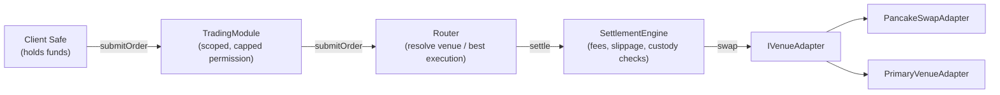

# RebaseX

A non-custodial routing and settlement system for a rebasing tokenised-equity
BEP-20, deployed live to BSC testnet for a smart-contract engineering
assessment. The headline behaviour: settlement accounting is entirely
**share-denominated**, and survives a corporate action (a rebase) without
creating or destroying a single unit of value — demonstrated below with real
on-chain transactions, not just asserted in a test.

## 1. What's here

- A client's **Safe** (non-custodial smart account) holds funds directly; a
  **TradingModule** grants a scoped, capped trading permission to an operator
  key without ever taking custody.
- A **Router** resolves an order to a venue — either an explicit choice or
  automatic best execution across every registered venue — and a
  **SettlementEngine** does the actual fund movement, fee capture, and
  slippage/deadline enforcement.
- Two venues sit behind one shared `IVenueAdapter` interface: a **primary
  market** (mint/redeem the equity token at par against a reserve vault) and
  a **PancakeSwap V2 AMM adapter**.
- The equity token is share-denominated internally — `balanceOf` is derived
  as `shares * multiplier / 1e18` — so a corporate action moves every
  balance by adjusting one number, never by touching individual holders.

## 2. Deployed Addresses (BSC testnet, chain ID 97)

All addresses below are read directly from [`deployments/bsc-testnet.json`](deployments/bsc-testnet.json), the machine-generated record from the actual `script/Deploy.s.sol` broadcast — not hand-transcribed.

| Contract | Address | Role |
|---|---|---|
| MockShareRegistry | [`0xba9B684bb809567aB843E22c0896D4Eb104f6Be6`](https://testnet.bscscan.com/address/0xba9B684bb809567aB843E22c0896D4Eb104f6Be6) | Records underlying share units backing the mock equity token |
| MockStable | [`0x31079AFc9cda9775D5aC69E81B13e041177D4952`](https://testnet.bscscan.com/address/0x31079AFc9cda9775D5aC69E81B13e041177D4952) | Mock 18-decimal stablecoin (mUSD), permissionless mint |
| MockRebasingEquityToken | [`0x52309eCD76c85f6DE126f739f7D6ce40FD151515`](https://testnet.bscscan.com/address/0x52309eCD76c85f6DE126f739f7D6ce40FD151515) | Rebasing tokenised equity (mEQ), share-denominated balances |
| VenueRegistry | [`0x6f8538E53c29A3658f73f64f9E3c50A606F06076`](https://testnet.bscscan.com/address/0x6f8538E53c29A3658f73f64f9E3c50A606F06076) | Maps a venueId to its adapter address |
| PancakeSwapAdapter | [`0x7a7124006E6623aAC43ED2a1f5aADf2E310F82a3`](https://testnet.bscscan.com/address/0x7a7124006E6623aAC43ED2a1f5aADf2E310F82a3) | AMM execution venue against the real PancakeSwap V2 router |
| PrimaryReserveVault | [`0x089e648D8a4c9849938aB6856bF1186B39eAc610`](https://testnet.bscscan.com/address/0x089e648D8a4c9849938aB6856bF1186B39eAc610) | Holds the stable reserve backing primary-market redemptions |
| PrimaryVenueAdapter | [`0xaB169a91529920BDFB98cE942200D3258cAd4c65`](https://testnet.bscscan.com/address/0xaB169a91529920BDFB98cE942200D3258cAd4c65) | Primary market: mints/redeems the equity token at par |
| SettlementEngine | [`0x4437806aE8F82a4AF5ecB4D0224b561109Dc4DDC`](https://testnet.bscscan.com/address/0x4437806aE8F82a4AF5ecB4D0224b561109Dc4DDC) | Executes settlement: pulls funds, calls the venue, applies the fee |
| Router | [`0xbC369EDe27CA6e70317161bB329760c1B7A51AB1`](https://testnet.bscscan.com/address/0xbC369EDe27CA6e70317161bB329760c1B7A51AB1) | Resolves a venueId (or runs best execution) and calls SettlementEngine |
| Safe (client account) | [`0x12d646771c8c87c535e0eEfdAEB29880E9f52465`](https://testnet.bscscan.com/address/0x12d646771c8c87c535e0eEfdAEB29880E9f52465) | Non-custodial client smart account, sole holder of funds |
| TradingModule | [`0x9371679385960005ad1E3275e8fd04b2d396D3b3`](https://testnet.bscscan.com/address/0x9371679385960005ad1E3275e8fd04b2d396D3b3) | Safe module granting scoped, capped trading authority to an operator |

**Venue IDs** (referenced directly by the routing logic):

| Venue | `venueId` (`keccak256(...)`) |
|---|---|
| `PANCAKE_V2` | `0xbed4079be2b2085074c8e018c29e583ba528d02bf887af9ab44f3ec550095725` |
| `PRIMARY_VENUE` | `0x41bd6f857c450f7ea1e8584fb36622d3646fc8d541d03f96f2db2c8b08d69024` |

All eleven contracts above are verified on BscScan testnet.

## 3. Demonstration Transactions

| Transaction | Link |
|---|---|
| Successful settlement | [`0xe0d64329421ebd9b400a2cc3349f60f765e7e4914b14771d571b3b2c2d1e1aa3`](https://testnet.bscscan.com/tx/0xe0d64329421ebd9b400a2cc3349f60f765e7e4914b14771d571b3b2c2d1e1aa3) |
| Corporate action applied | [`0xe4ef4ed0b9209edbb52d32f006ff6c77312c2a1b05b9cdd7895c9261eea50855`](https://testnet.bscscan.com/tx/0xe4ef4ed0b9209edbb52d32f006ff6c77312c2a1b05b9cdd7895c9261eea50855) |
| Settlement after corporate action, showing correct quantities | [`0x6572de683a7931dec163c1b915b0612a9fe2b678a4974f47e354b3af63a95a28`](https://testnet.bscscan.com/tx/0x6572de683a7931dec163c1b915b0612a9fe2b678a4974f47e354b3af63a95a28) |

For the third transaction: the corporate action doubled the multiplier from
`1e18` to `2e18`. Selling a nominal amount of equity tokens at the new
multiplier resolved, on-chain, to **`sharesIn = 49.99e18`** debited from the
Safe — the *exact* figure independently computed pre-trade from the new
multiplier (`amountToShares`, floored), not an approximation. This is the
concrete, on-chain evidence for "no value created or destroyed across a
rebase," not just an assertion in a test file.

## 4. Architecture Overview

A client never grants custody of funds to anything in this system. The Safe
holds assets directly; every component downstream of it only ever moves
funds *through* it, for the duration of one settlement transaction, and
retains nothing:



**The modularity claim, concretely:** adding the primary market as a second
venue (Part B) required **zero changes** to `Router.sol` or
`SettlementEngine.sol`. The primary market is just another contract
implementing `IVenueAdapter`, registered in `VenueRegistry` exactly like the
AMM adapter. Router's pre-existing best-execution loop —
`for each registered venue: try adapter.quote(...); keep the highest` —
already compares any number of venues without knowing what any of them are;
pointing it at a mint/redeem venue instead of an AMM required no new
comparison logic anywhere.

## 5. Rebase Policy

**The token rebases UP-ONLY: the multiplier is strictly non-decreasing.
Reverse splits and downward corporate actions are out of scope.**

This is enforced on-chain: `applyCorporateAction` reverts with
`MultiplierNotIncreasing` unless `newMultiplier > currentMultiplier`. An
up-only multiplier turns "no value is destroyed across a rebase" into a
monotonic, fuzzable invariant rather than a claim that has to be re-argued
for every possible direction of change. It also removes an entire failure
mode from settlement: a downward rebase landing between a client's quote and
their execution could otherwise push a settlement's realised output below
the `minAmountOut` floor they set, for a reason that has nothing to do with
market conditions.

## 6. Part B Choice — Primary vs Secondary Routing

**Primary vs Secondary Routing** was the option built. It reuses the
`Router`/`VenueRegistry` venue abstraction that already exists for the AMM
leg, rather than adding a parallel subsystem alongside it — see Section 4 for
what that reuse actually looks like in practice. It's also the option most
directly relevant to a smart-order-routing product: the interesting claim to
prove is that a primary issuer and a secondary market can compete for the
same order under one routing decision, with neither hard-coded as preferred.

There's a real overlap with the *Proof of Collateral* alternative that was
not chosen: primary-market minting is already gated on
`MockShareRegistry.availableShares` — a mint reverts if it would issue more
shares than the registry records as backed. A meaningful part of Proof of
Collateral's mechanism (bounding issuance to attested backing) exists here as
a side effect of the routing choice, though a real attestation-freshness
layer was not built (see Section 9).

## 7. Test Suite

**451 tests, 451 passing, 0 failed, 0 skipped** — unit, fuzz, invariant, and
a fork suite run against the real BSC testnet RPC, all currently green.

| Contract | Line coverage | Branch coverage |
|---|---|---|
| SettlementEngine.sol | 100% (130/130) | 100% (44/44) |
| Router.sol | 100% (42/42) | 100% (19/19) |
| TradingModule.sol | 100% (75/75) | 88.24% (15/17) |
| PancakeSwapAdapter.sol | 100% (22/22) | 100% (4/4) |
| PrimaryVenueAdapter.sol | 100% (43/43) | 100% (14/14) |
| PrimaryReserveVault.sol | 100% (23/23) | 100% (5/5) |
| MockRebasingEquityToken.sol | 100% (112/112) | 94.44% (17/18) |
| MockShareRegistry.sol | 100% (46/46) | 100% (11/11) |
| VenueRegistry.sol | 100% (27/27) | 100% (6/6) |
| MockStable.sol | 66.67% (4/6) | 100% (0/0) — trivial 3-function mock (constructor, `decimals`, `mint`) |

(Whole-repository aggregate — including test-only mocks and harnesses, which
dilute the figure and are not the thing being graded — is 78.89% lines /
78.88% branches. The table above is what matters: every production contract
central to settlement is at 100% line coverage, with branch coverage in the
88–100% range everywhere except the trivial mock stable.)

**What's covered, explicitly, matching the brief's own list of cases:**
- **No value created or destroyed across a rebase** —
  `invariant_totalSharesEqualsNetMintFlow`,
  `invariant_sumOfActorSharesEqualsTotalShares`, and
  `invariant_registryBackingMatchesIssuedShares` in
  `test/invariant/RebasingTokenInvariant.t.sol`, plus the live on-chain proof
  in Section 3.
- **Operator cannot withdraw** — `test_OperatorCannotWithdrawFromSafe` and
  `test_ModuleExposesNoWithdrawalFunction` in `test/TradingModule.t.sol`;
  `TradingModule` exposes no function that moves funds to any destination
  other than through a `Router.submitOrder` call.
- **Slippage bound enforced** — `test_MinAmountOutAtGross_RevertsInsufficientOutput`
  in `test/SettlementEngine.t.sol`.
- **Deadline enforced** — `test_ExpiredDeadline_RevertsDeadlineExpired`
  (`SettlementEngine`) and `test_revert_deadlineExpired` (`Router`) — checked
  independently in both places, since the Router is not trusted as the last
  line of defence.

**The fork suite's key finding** (`test/fork/PancakeSwapSettlement.fork.t.sol`,
run against a live BSC testnet fork): a corporate action landing between
pool seeding and a settlement caused the real PancakeSwap pool to mis-price
a sell by roughly **1000x** — selling a nominal 500 equity tokens returned
~499,524 stable instead of ~500. The mechanism: the corporate action doubles
every `balanceOf`, including the pool's, but does **not** touch the pool's
cached `reserve0`/`reserve1` — only `sync`/`mint`/`burn`/`swap` do that — so
the AMM prices the trade against reserves that no longer describe what it
actually holds. `SettlementEngine`'s own custody invariants held throughout
even against this mispriced fill; only the *price*, not the *accounting*,
was wrong. Full discussion in Part C.

## 8. Deployment — one command, reproducible

```bash
git clone <repo>
cd <repo>
forge install
cp .env.example .env  # fill in PRIVATE_KEY (0x-prefixed), BSC_TESTNET_RPC_URL, BSCSCAN_API_KEY
forge script script/Deploy.s.sol --rpc-url $BSC_TESTNET_RPC_URL --broadcast --verify --etherscan-api-key $BSCSCAN_API_KEY
```

`PRIVATE_KEY` must include the `0x` prefix — `vm.envUint` requires it, which
differs from the raw hex format most wallets export by default.

Deployment order is otherwise linear (token layer, then both venues, then
settlement core, then the Safe stack), with **one non-obvious step**:
`SettlementEngine` and `Router` have a circular dependency — `Router`'s
constructor takes the engine's address, but the engine gates `settle()` on
the Router's address, so neither can be immutably wired at the other's
construction time. This is resolved with a one-time `initializeRouter()`
call after both are deployed, which can only ever succeed once
(`RouterAlreadyInitialized` on any second attempt).

## 9. Known Limitations and Divergences from the Brief

- **`MockShareRegistry` tracks backing via `setCustodiedShares`, not a
  timestamped attestation/staleness model.** This is a simplification from
  the originally sketched attestation layer, made because *Proof of
  Collateral* was not the chosen Part B option (Section 6). There is no
  `isAttestationFresh` check, no staleness bound, and no attestor role.
- **No bound on the SIZE of a single corporate action** — only its
  *direction* is constrained. `applyCorporateAction` enforces
  `newMultiplier > currentMultiplier` (`MultiplierNotIncreasing`) and nothing
  else; a single call from a compromised `CORPORATE_ACTION_ROLE` key could
  set an arbitrarily large multiplier in one step. A production version
  should add a bounded per-action jump (e.g. a max basis-point increase per
  call) to limit the blast radius of a compromised admin key — this was not
  implemented.
- **`VenueRegistry.setAdapter` is a single immediate admin call, not
  timelocked.** A scope cut given the assessment window. A production
  version would add a propose/commit delay: registering or replacing an
  adapter is the most privileged, least-bounded action in the system — it
  points the Router at whatever code the registered address holds — and an
  immediate, unilateral change gives no window for a client to react to a
  malicious or mistaken registration before it can be used.
- **`PancakeSwapAdapter` is single-hop only.** No multi-hop path resolution;
  it supports exactly a direct `[assetIn, assetOut]` path.
- **No automatic AMM pool recapitalization or reserve-sync mechanism after a
  corporate action.** `quote()` fails safe — it returns `0` rather than a
  wrong number when a real revert occurs — but as Section 7's fork finding
  shows, a *successful* quote against stale reserves can still be badly
  wrong. The underlying tension (a rebasing balance inside a pool that
  assumes fixed reserves) is disclosed, not solved, on-chain.
- **Both demo settlements resolved to `PRIMARY_VENUE`, not
  `PancakeSwapAdapter`**, because no organic PancakeSwap liquidity exists for
  these freshly-minted mock tokens — the AMM leg quotes `0` and always loses
  the best-execution comparison. The comparison logic itself is genuinely
  exercised (it's the same `Router` code path either way); the AMM side of
  it, and the real best-execution decision between a live quote and the
  primary market, is what the fork test suite exercises instead, against a
  pool it seeds itself on BSC testnet.

## 10. Attribution

Third-party code used in this project. All dependencies are pinned to a tag
(not a branch), with the resolved commits recorded in `foundry.lock`.

| Dependency | Version | Commit | License | Used for |
| --- | --- | --- | --- | --- |
| [foundry-rs/forge-std](https://github.com/foundry-rs/forge-std) | `v1.16.2` | `bf647bd` | MIT | Test framework and cheatcodes (test-only) |
| [OpenZeppelin/openzeppelin-contracts](https://github.com/OpenZeppelin/openzeppelin-contracts) | `v5.7.0` | `cab1993` | MIT | `AccessControl`, `ERC20`, `SafeERC20`, `ReentrancyGuard`, `EnumerableSet`, `Math` |
| [safe-global/safe-smart-account](https://github.com/safe-global/safe-smart-account) | `v1.4.1` | `bf943f8` | LGPL-3.0-only | Client smart account and module system (non-custodial proof): `Safe`, `SafeProxyFactory`, `ModuleManager` |

- **PancakeSwap V2** Router/Factory interfaces, and its real testnet
  deployment, referenced for the AMM venue adapter.
- Read bStocks' public documentation for context on how a live rebasing
  tokenised-equity system handles the multiplier, mint/redeem, and proof of
  collateral, per the brief's suggestion — no code or contracts integrated
  from it.

### Why Safe v1.4.1, not the newer v1.5.0

`v1.4.1` is the release whose singleton and `SafeProxyFactory` are deployed
at canonical, cross-chain CREATE2 addresses on BSC — confirmed directly
on-chain (`cast code`) against BSC testnet before `script/Deploy.s.sol`
hardcoded either address, rather than assumed from Safe's deployments
repository alone. A module written against v1.4.1 therefore works with Safes
that exist today, rather than with a version users would first have to
migrate to. v1.4.1 declares `pragma solidity >=0.7.0 <0.9.0` and compiles
cleanly under this repo's pinned `solc 0.8.24`.

Safe is LGPL-3.0-only. It is consumed unmodified as a library dependency, and
no Safe source file is copied into `src/`; every RebaseX contract remains
MIT.

## 11. AI Assistance Disclosure

Claude (Anthropic) was used throughout this assessment for design
discussion, prompt-driven implementation via Claude Code, and iterative
review of the contracts before deployment. Every non-trivial design
decision — the up-only multiplier policy, the share-denominated allowance
and fee mechanics, the rebasing-leg detection approach, the Safe module's
permission model, the primary-vs-secondary routing choice — was discussed,
challenged, and in several cases revised after identifying bugs in an
earlier proposed approach (e.g. an initial sell-side share-recovery
calculation that would have under-counted redeemed shares, later corrected
via the exact ceiling-inverse of the settlement engine's floor conversion).
All code was reviewed line-by-line before deployment.
